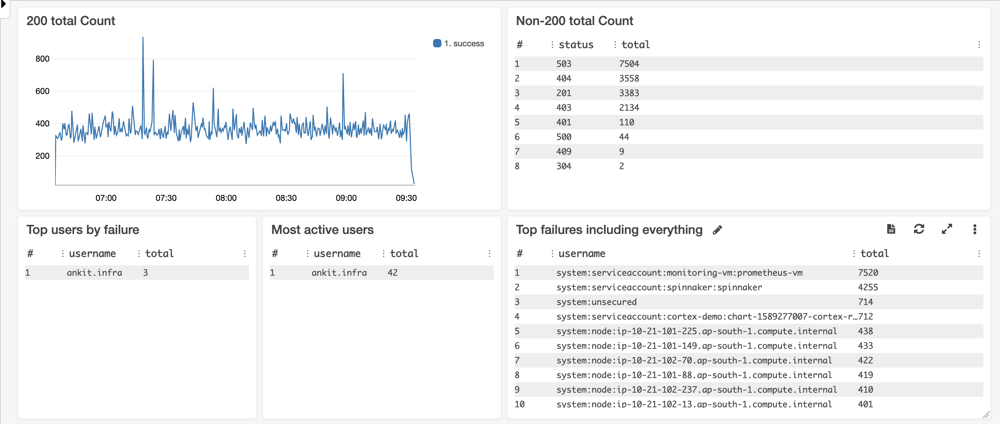
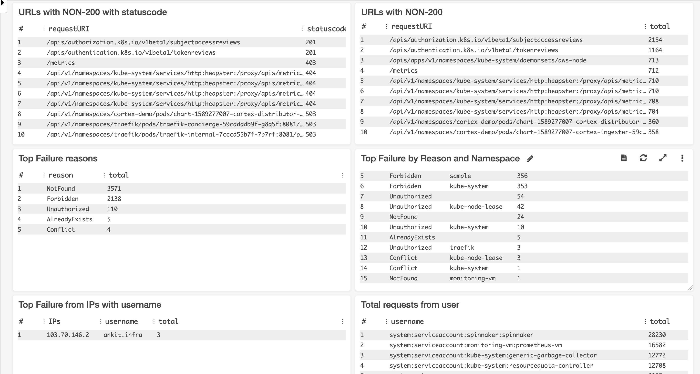

# EKS Cloudwatch Dashboard

In EKS, we have 5 major components that are supported for logging and logs are being pushed to CloudWatch if enabled.

Those Components include:

1. Apiserver Logs
2. Audit Logs
3. Authenticator Logs
4. Controller manager Logs
5. Scheduler Logs

## Dashboard for EKS Audit Logs

As of now, we have added only cloudwatch dashboard for Audit Logs, it will look like this--





### Setup

To setup the EKS Audit logs dashboard, follow the setups:

1. Download the `audit-logs-dashboard.json` file.

    ```shell
    wget https://raw.githubusercontent.com/ankitjain28may/eks-cloudwatch-dashboard/master/audit-logs-dashboard.json
    ```

2. Find the source from the cloudwatch log group for eks and replace the `CLODUWATCH_SOURCE` with the log group. 

    ```shell
    sed -i "s/CLODUWATCH_SOURCE/<cloudwatch-log-group-for-eks>/g" audit-logs-dashboard.json
    ```

3. Create a new dashboard in cloudwatch and give it appropriate name.

4. Import the updated `audit-logs-dashboard.json` as source to the above created dashboard.

## Contribute

Feel free to contribute

## License

Copyright (c) 2020 Ankit Jain - Released under the MIT License